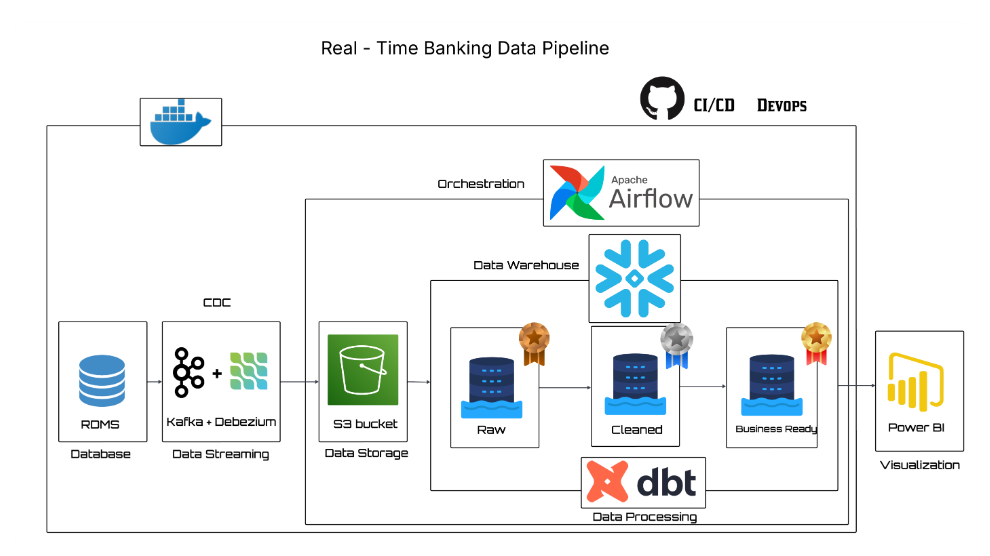

# 🏦 Banking Modern Data Stack


## 📌 Project Overview

This project demonstrates an **end-to-end modern data stack pipeline**
for a **Banking domain**.
We simulate customer, account, and transaction data, stream changes in real time, transform them into analytics-ready models, and visualize insights — following best practices of CI/CD and data warehousing.

👉 Think of it as a **real-world banking data ecosystem** built on modern data tools.

## 🏗️ Architecture


### Pipeline Flow:
1.**Data Generator** → Simulates banking transactions, accounts & customers (via Faker).
2.**Kafka + Debezium** → Streams change data (CDC) into MinIO (S3-compatible storage).
3.**Airflow** → Orchestrates data ingestion & snapshots into Snowflake.
4.**Snowflake** → Cloud Data Warehouse (Bronze → Silver → Gold).
5.**DBT** → Applies transformations, builds marts & snapshots (SCD Type-2).
6**CI/CD with GitHub Actions** → Automated tests, build & deployment.

## 🛠️ Tech Stack

- ❄️ **Snowflake** → Cloud Data Warehouse
- 🔁 **DBT** → Transformations, testing, snapshots (SCD Type-2)
- 🌀 **Apache Airflow** → Orchestration & DAG scheduling
- 📨 **Apache Kafka + Debezium** → Real-time streaming & CDC
- 🪣 **MinIO** → S3-compatible object storage
- 🐘 **Postgres** → Source OLTP system
- 🐍 **Python (Faker)** → Data simulation
- 🐳 **Docker & docker-compose** → Containerized setup
- 🔧 **Git & GitHub Actions** → CI/CD workflows

## Key Features

- **PostgreSQL OLTP:** Source relational database with ACID guarantees (customers, accounts, transactions)
- **Simulated banking system:** customers, accounts, and transactions
- **Change Data Capture (CDC)** via Kafka + Debezium (capturing Postgres WAL)
- **Raw → Staging → Fact/Dimension** models in DBT
- **Snapshots for history tracking** (slowly changing dimensions)
- **Automated pipeline orchestration** using Airflow
- **CI/CD pipeline** with dbt tests + GitHub Action

## Repository Structure

## 📁 Repository Structure

```plaintext
banking-modern-datastack/
├── .github/workflows/          # CI/CD pipelines (ci.yml, cd.yml)
├── banking_dbt/                # DBT project
│   ├── models/
│   │   ├── staging/            # Staging models
│   │   ├── marts/              # Facts & dimensions
│   │   └── sources.yml
│   ├── snapshots/              # SCD2 snapshots
│   └── dbt_project.yml
│
├── consumer/
│   └── kafka_to_minio.py
│
├── data-generator/             # Faker-based data simulator
│   └── faker_generator.py
│
├── docker/
│   └── dags/                   # Airflow DAGs, plugins, etc.
│       ├── minio_to_snowflake.py
│       └── scd_snapshots.py
│
├── kafka_debezium/             # Kafka connectors & CDC logic
│   └── generate_and_post_connector.py
│
├── postgres/                   # Postgres schema (OLTP DDL & seeds)
│   └── schema.sql
│
├── .gitignore
├── docker-compose.yml          # Containerized infra
├── dockerfile-airflow.dockerfile
├── requirements.txt
└── README.md
```
